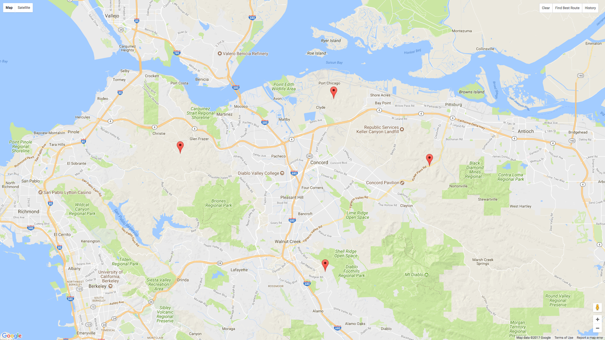
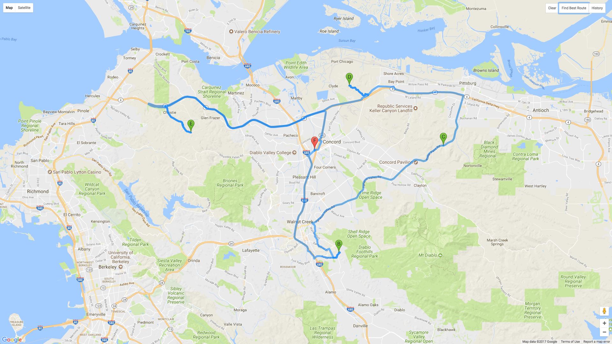

# Trip Planner 




Trip Planner is a react/google maps api based web-app that finds the user’s current location and allows the user to drop several markers/pins down. Once a few markers are down it becomes possible to find the best route starting and ending from the current location to all the markers based on time. Once a route has been found it is added to the history so that a user can go back and either run the route again or add more markers to the route. The user also has the ability to clear the route to start a new one.

### Features
Upon allowing access to location, a call to find the browsers location is made. When the location has been found the map pans to center over the new location. By default the map centers to San Francisco.
```javascript
  componentWillMount() {
    this.props.findLocation();
  }
...
  componentWillReceiveProps(nextProps) {
    if (Object.keys(this.props.coords).length === 0 && Object.keys(nextProps.coords).length > 0) {
      let center = new google.maps.LatLng(nextProps.coords.lat, nextProps.coords.lng);
      this.map.panTo(center);
    }
  }
```



After dropping several markers, clicking the `Find Best Route` button sends off the call to Google Maps Direction Service to find the best route between the current location and all the markers that have been placed. All markers become way points that have the `stopover` property set to true which allows Direction Service to know it has to passover each one. Once the response comes back it is filtered to make sure there are not any legs of the route passing through itself. [Read](https://developers.google.com/optimization/routing/tsp/tsp) more about how Google solves the traveling salesman problem.

```javascript
  getDirections() {
    let directions = new google.maps.DirectionsService();

    directions.route({
      origin: this.props.coords,
      destination: this.props.coords,
      waypoints: this.props.nodes.map(node => ({ location: node, stopover: true })),
      optimizeWaypoints: true,
      travelMode: google.maps.TravelMode.DRIVING,
      unitSystem: google.maps.UnitSystem.IMPERIAL
    }, callback.bind(this));

    function callback(response, status) {
      if (status === "OK") {
        let history = {};

        response.routes[0].legs = response.routes[0].legs.filter(leg => leg.distance.value > 0);
        console.log(response.routes);
        history.name = this.props.getHistoryName(response.routes[0].legs);
        history.markers = this.props.markers;

        this.props.addHistory(history);
        this.clearMarkers();

        this.props.directionsDisplay.setMap(this.props.map);
        this.props.directionsDisplay.setDirections(response);
      }
      else {
        window.alert('Directions request failed due to ' + status);
      }
    }
  }
  ```

`Clear` removes all placed markers so that you can start over. This is also do automatically after a route has been found and the map is clicked on again. If more markers need to be added, first find the route in `History`.

`History` stores all the markers of routes that have been found for fast look up of old routes. When an old route has been selected the map is cleared then the old markers appear again. They can be added to or the route can be found again by clicking the `Find Best Route` button.

### Future Plans:
- [x] instruction modal when page first loads
- [ ] option to set start and end points
- [ ] store history to the browser using localStorage for continuous history
- [ ] undo button
- [ ] allow for a route to be added to once it has been found
- [ ] integrate Google Places API to allow for a place to be searched for
